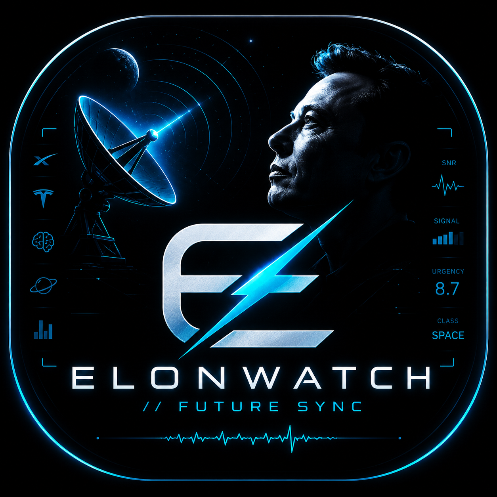

<p align="center">
  
</p>

<h1 align="center">ELONWATCH // FUTURE SYNC</h1>
<p align="center"><em>Real-time consciousness feed for Elon Musk signal intelligence</em></p>

<p align="center">
  
  
  
  
</p>

---

ElonWatch scrapes every tweet, news article, and Reddit post about Elon Musk every hour — then runs every item through a live classification engine that decodes **domain** (SPACE / AI / POLITICS / MONEY / CHAOS ...), **signal type** (DIRECTIVE / VISION / REACTION / HUMOR), **urgency** (0–10), and **sentiment**. The result is a real-time consciousness feed displayed in a cyberpunk TUI, with macOS push notifications for new tweets and high-signal items.

Zero API keys. Zero subscriptions. Pure open-source signal.

---

## Features

| | |
|---|---|
| **Sources** | Twitter/X via nitter.net · Google News RSS · Reddit (r/elonmusk, r/spacex, r/teslamotors, r/neuralink) |
| **Brain engine** | Domain classifier · Signal/noise scorer · Urgency 0–10 · Sentiment analysis |
| **TUI** | Cyberpunk Future Sync terminal — domain pulse bars, consciousness feed, signal brain panel, scrolling ticker |
| **macOS** | Menubar app (◈) + push notifications + hourly launchd scraper + DMG installer |
| **Ubuntu** | TUI + systemd hourly timer |
| **Storage** | SQLite, zero config |

---

## Install

### macOS (DMG)

1. Download `ElonWatch.dmg` from [Releases](../../releases)
2. Open DMG → drag `ElonWatch.app` to `/Applications`
3. Right-click → **Open** (first launch, bypasses Gatekeeper on unsigned app)

The app lives in your menubar as `◈`. Click it to see stats, trigger a sync, or open the full TUI console.

### macOS (from source)

```bash
git clone https://github.com/YOUR_USERNAME/elonwatch.git
cd elonwatch
python3 -m venv venv && source venv/bin/activate
pip install -r requirements-macos.txt

# Hourly background scraper via launchd
bash install.sh

# Launch TUI
bash elonwatch.sh

# Launch menubar app
bash elonwatch_menubar.sh
```

### Ubuntu / Linux

```bash
git clone https://github.com/YOUR_USERNAME/elonwatch.git
cd elonwatch
bash install-ubuntu.sh   # sets up venv + systemd timer

bash elonwatch.sh        # launch TUI
```

---

## TUI Keybinds

| Key | Action |
|-----|--------|
| `a` | All sources |
| `t` | Twitter/X only |
| `n` | Google News only |
| `r` | Reddit only |
| `c` | CHAOS domain filter |
| `p` | SPACE domain filter |
| `i` | AI domain filter |
| `s` | Trigger scrape now |
| `?` | Glitch message |
| `q` | Quit |

---

## Architecture

```
elonwatch/
├── tui.py              # Future Sync TUI (textual)
├── menubar.py          # macOS menubar app (rumps)  [macOS only]
├── scrapers.py         # Nitter · Google News · Reddit scrapers
├── brain.py            # Signal classification engine
├── db.py               # SQLite storage
├── notify.py           # macOS push notifications  [macOS only]
├── scrape_worker.py    # Standalone worker for launchd / systemd
├── install.sh          # macOS launchd installer
├── install-ubuntu.sh   # Ubuntu systemd installer
├── build_dmg.sh        # Rebuild DMG (macOS)
├── requirements-macos.txt
└── requirements-ubuntu.txt
```

**Data sources — all free, no keys required:**

- **Twitter/X** — scraped via public [nitter.net](https://nitter.net) RSS feeds for `@elonmusk`, `@SpaceX`, `@Tesla`, `@xai`, `@boring_company`
- **Google News** — RSS feeds for 7 search queries
- **Reddit** — RSS from r/elonmusk, r/spacex, r/teslamotors, r/neuralink, and search

---

## Notifications

Push notifications fire for:
- Any new tweet from **@elonmusk** directly
- Any item scoring **urgency ≥ 7** (high signal)
- Any item classified as **CHAOS** domain

---

## License

MIT
